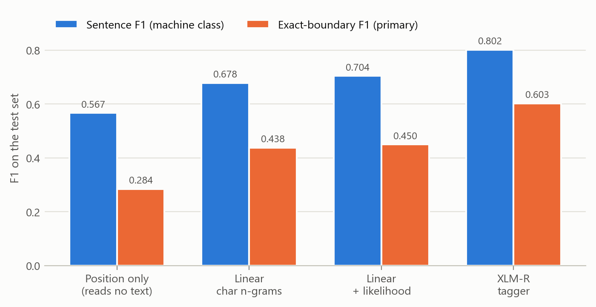
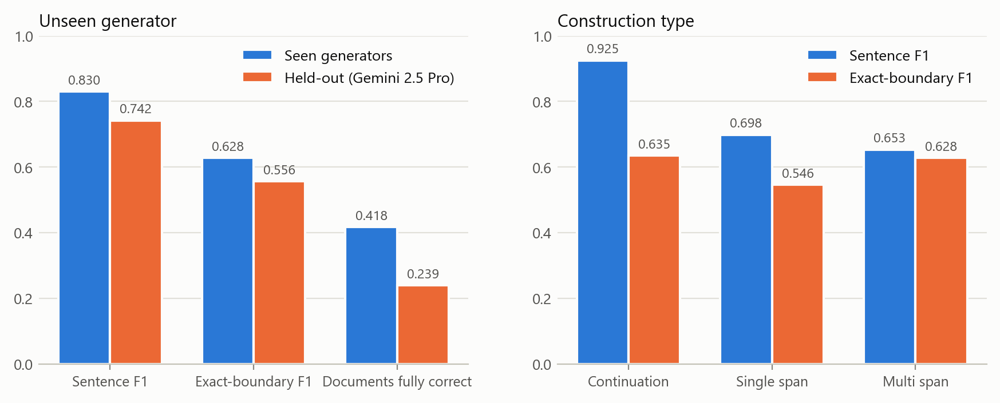
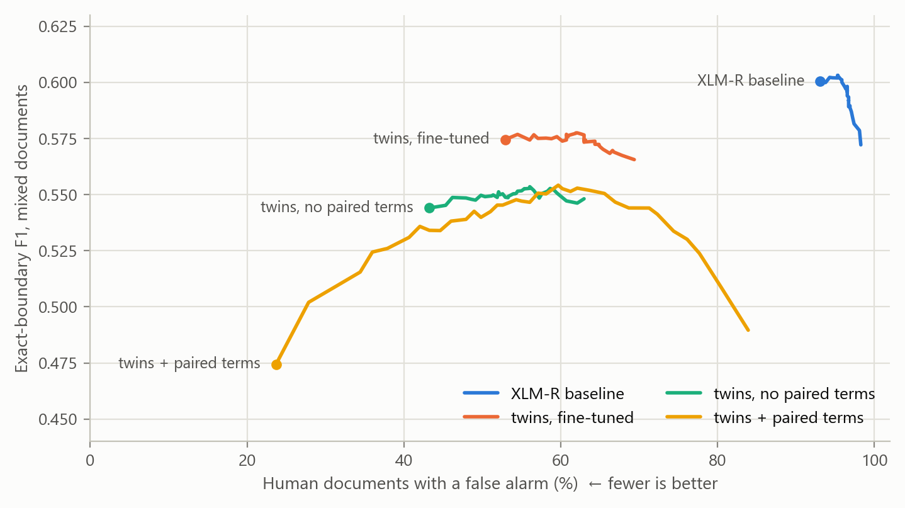
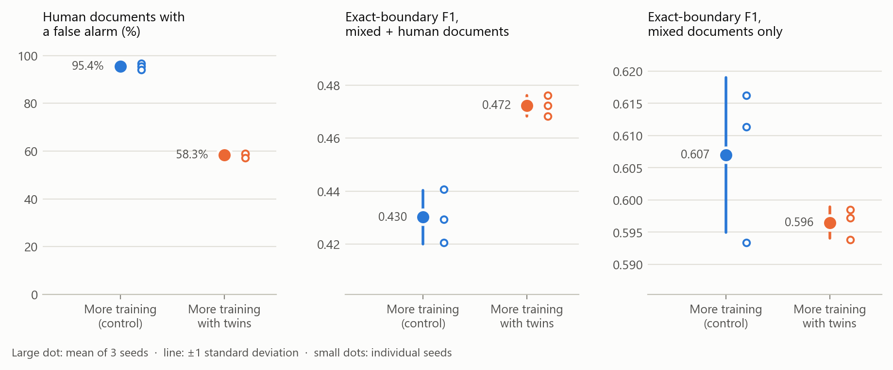
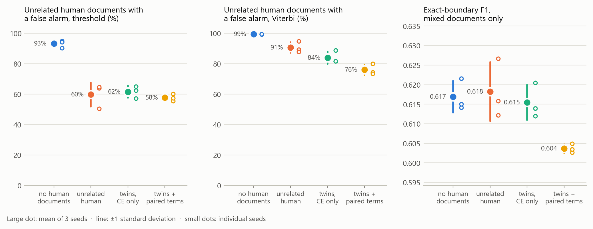
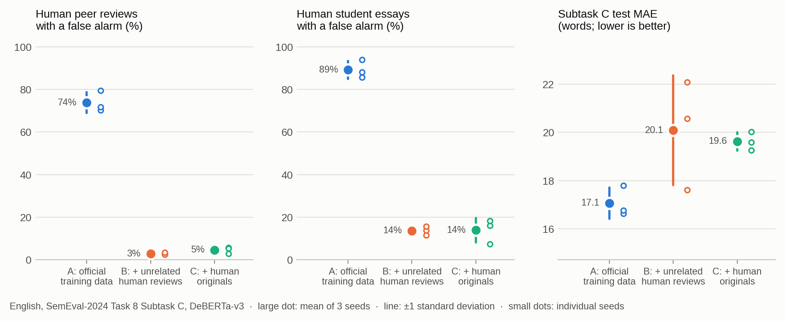
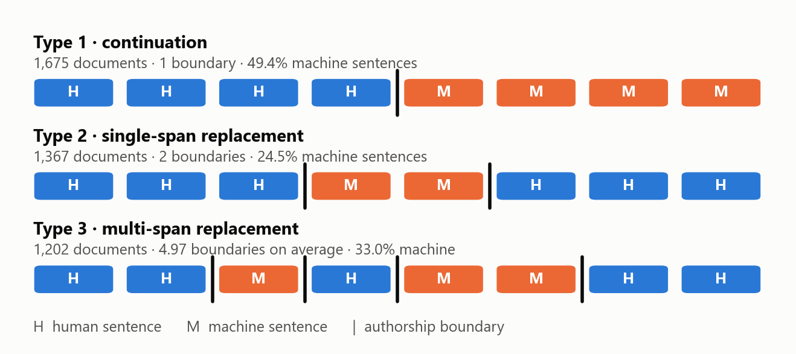
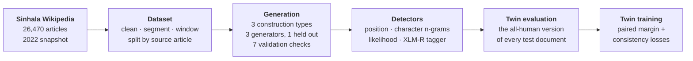

# Sinhala human–AI authorship boundary detection

**Can a detector find where a Sinhala document switches from human to machine writing?**<br>
A 4,244-document benchmark built from Sinhala Wikipedia, detectors from character n-grams to a
fine-tuned XLM-RoBERTa tagger, and counterfactual-twin training for purely human text.

[](docs/reproducing.md#environment)
[](docs/reproducing.md#environment)
[](docs/reproducing.md#environment)
[](tests/)
[](LICENSE)
[](https://huggingface.co/datasets/said-sinhala-ai-dataset/said-bound)

Every document mixes human sentences with sentences written by a large language model. Each
sentence is labelled human or machine, and a **boundary** is any point where the label changes.
The task is to recover those boundaries from the text alone.

The dataset is released as **Sinhala-BOUND**, the boundary-detection subset of
[SAID](https://huggingface.co/said-sinhala-ai-dataset) (Sinhala AI-text Identification Dataset).

## Key findings

- **Encoding the whole document is the largest gain.** A fine-tuned XLM-RoBERTa tagger reaches
  0.603 exact-boundary F1, against 0.438 for a per-sentence linear model and 0.284 for a
  baseline that reads no text at all.
- **Unseen generators and embedded rewrites remain hard.** Exact-boundary F1 falls from 0.628
  to 0.556 on a generator held out of training, and sentence F1 drops from 0.925 on
  continuations to 0.65–0.70 on spans rewritten inside human text.
- **Detectors trained on mixed documents invent machine text in human documents.** Shown the
  all-human version of each test document, the tagger flags machine text in **95%** of them,
  and **no decision threshold brings that below 93%**.
- **Human-only training text fixes much of it, and twins add a little more.** Fine-tuning
  on each document together with its all-human twin cuts those false alarms from 95% to
  **58%**, on every one of three seeds, and raises exact-boundary F1 over mixed and human
  documents by 4 points, for about 1 point of F1 on mixed documents alone. But **unrelated
  human documents of the same length get most of the way (60%)**. Content matching and the
  paired losses it enables add a smaller, consistent gain: 2–5 points of false alarms with
  threshold decoding, 13–15 with Viterbi decoding.
- **The false-alarm problem is not specific to Sinhala.** On the English SemEval-2024
  Task 8 boundary task (Subtask C), a DeBERTa-v3 tagger trained on the official data flags
  machine text in **74%** of human peer reviews and **89%** of human student essays. Adding
  about half as many human-only documents cuts that to **3–5% and 14%** on every seed, but
  raises test MAE from 17.1 to 19.6–20.1 words: a larger cost than in Sinhala.
- **Language-model likelihood transfers across generators.** On the unseen generator, a
  detector given only likelihood features, and no text, beats character n-grams on sentence
  F1 (0.588 vs 0.571).

## Results

<picture>
  <source media="(prefers-color-scheme: dark)" srcset="docs/assets/fig2-models-dark.png">
  
</picture>

**Detectors.** Exact-boundary F1 is the primary metric: a predicted boundary counts only at
the exact sentence, and the trivial all-human and all-machine predictors score 0 on it. Only
the document-level tagger clears 0.5.

<picture>
  <source media="(prefers-color-scheme: dark)" srcset="docs/assets/fig3-breakdown-dark.png">
  
</picture>

**Generalisation and difficulty.** The gap to the held-out generator widens as the metric gets
stricter: the share of documents with every boundary right nearly halves. Continuation is far
easier than rewriting spans inside human text.

<picture>
  <source media="(prefers-color-scheme: dark)" srcset="docs/assets/fig4-twin-tradeoff-dark.png">
  
</picture>

**False alarms on human text.** Each curve sweeps one model's decision threshold from 0.05 to
0.95. The baseline cannot be made quiet on human documents at any threshold. Twin fine-tuning
keeps most of its accuracy while halving false alarms; twin training from scratch reaches the
lowest rate, 24%, at a larger accuracy cost.

<picture>
  <source media="(prefers-color-scheme: dark)" srcset="docs/assets/fig5-seeds-dark.png">
  
</picture>

**Three seeds.** The trained tagger fine-tuned for three more epochs with twins, against a
control given the same three epochs without them. The false-alarm reduction is 37.1 ± 0.7
points and holds on every seed; the mixed-document cost is 1.0 ± 1.0 points.

<picture>
  <source media="(prefers-color-scheme: dark)" srcset="docs/assets/fig6-conditions-dark.png">
  
</picture>

**Is it the twin, or any human text?** Four fine-tuning conditions, three seeds each, with
false alarms measured on 618 human test documents unrelated to any mixed document. Adding
unrelated human text gives most of the reduction. Content-matched twins, and the paired
losses they make possible, lower false alarms further on every seed, most clearly with
Viterbi decoding, at about one point of mixed-document F1.

<picture>
  <source media="(prefers-color-scheme: dark)" srcset="docs/assets/fig7-english-dark.png">
  
</picture>

**English replication.** SemEval-2024 Task 8 Subtask C, in its native word-level form. The
tagger trained on the official data flags most human documents; adding unrelated human reviews
(B) or the reviews the training documents were cut from (C), in equal amounts, removes almost
all of those false alarms, including on essays, a genre absent from training. B and C are
level, so content matching adds nothing here. The price is about 3 words of MAE.

### At a glance

| | Question | Answer | Evidence |
|---|---|---|---|
| **1** | Can text be localised better than position alone? | Yes: 0.603 vs 0.284 exact-boundary F1 | [xlmr](results/detection/xlmr/xlmr.md) |
| **2** | Does it hold for an unseen generator? | Partly: 0.556 vs 0.628 | [xlmr](results/detection/xlmr/xlmr.md) |
| **3** | Do likelihood features help? | Linear model yes, XLM-R no (redundant) | [linear](results/detection/baselines/linear.md), [xlmr_likelihood](results/detection/xlmr/xlmr_likelihood.md) |
| **4** | Does the tagger stay quiet on human documents? | No: 95% false alarms at any threshold | [twin_tradeoff_laptop](results/detection/twins/twin_tradeoff_laptop.md) |
| **5** | Do counterfactual twins reduce that? | Yes: 95% → 58%, 3/3 seeds | [twin_ft_seeds](results/detection/twins/twin_ft_seeds.md) |
| **6** | At what cost on mixed documents? | About 1 point exact-boundary F1 | [twin_ft_seeds](results/detection/twins/twin_ft_seeds.md) |
| **7** | Is it the twin, or any human text? | Mostly any human text: unrelated 60% vs twins 58%; twins add 2–5 points (threshold), 13–15 (Viterbi) | [four_conditions](results/detection/twins/four_conditions.md) |
| **8** | Do formatting cues drive the scores? | No: removing them changes F1 by ≤ 1.2 points | [surface_noise](results/detection/surface_noise.md) |
| **9** | Does the false-alarm problem hold in English? | Yes: 74–89% of human documents flagged (SemEval-2024 Subtask C) | [seeds](results/replication/semeval_c/seeds.md) |
| **10** | Does human-only training data fix it there? | Yes: to 3–14%, 3/3 seeds, but test MAE rises 17.1 → 19.6–20.1 | [seeds](results/replication/semeval_c/seeds.md) |

## Dataset

<picture>
  <source media="(prefers-color-scheme: dark)" srcset="docs/assets/fig1-constructions-dark.png">
  
</picture>

**4,244 documents · 39,358 labelled sentences · 2,630 source articles · 36.4% machine
sentences.** Human text comes from a 2022 Sinhala Wikipedia snapshot, taken before the public
release of ChatGPT. Machine text always *replaces* human sentences in place, so the surrounding
text stays genuine and every mixed document has an exactly aligned all-human twin.

| generator | role | train | dev | test | total |
|---|---|---|---|---|---|
| DeepSeek V3 | seen | 1,186 | 273 | 302 | 1,761 |
| GPT-4o (2024-11-20) | seen | 1,304 | 283 | 311 | 1,898 |
| Gemini 2.5 Pro | held out | 0 | 280 | 305 | 585 |
| **total** | | **2,490** | **836** | **918** | **4,244** |

Splits are assigned over source articles before any generation, so no human passage appears in
more than one split. Seven automatic checks gate every generation; failures are regenerated,
never hand-edited. See [Dataset construction](docs/dataset.md).

The dataset is on the Hugging Face Hub as
[`said-sinhala-ai-dataset/said-bound`](https://huggingface.co/datasets/said-sinhala-ai-dataset/said-bound),
with the mixed documents, each document's all-human twin, and unrelated human documents for
false-alarm testing:

```python
from datasets import load_dataset

bound = load_dataset("said-sinhala-ai-dataset/said-bound")                     # mixed documents
twins = load_dataset("said-sinhala-ai-dataset/said-bound", "human_originals")  # all-human twins
```

## Study design



The protocol is fixed throughout: train on seen generators only, choose epochs and thresholds on
development data restricted to seen generators, and report on test overall, seen and held out.

## Repository layout

```
.
├── src/
│   ├── dataset/            # cleaning, segmentation, windowing, splits, generation, validation, Hub export
│   ├── detect/             # baselines, linear, likelihood, XLM-R tagger, twin training and analysis
│   ├── replication/        # English replication on SemEval-2024 Task 8 Subtask C
│   ├── app/serve.py        # local web demo of the tagger
│   ├── segment.py          # the single Sinhala sentence segmenter, shared by every stage
│   └── utils.py
├── results/
│   ├── dataset/            # dataset audit
│   ├── generation/         # generator pilot, fluency review, cross-model comparison, evidence
│   ├── detection/
│   │   ├── baselines/      # trivial, positional and linear detectors
│   │   ├── xlmr/           # the XLM-R tagger, with and without likelihood features
│   │   └── twins/          # counterfactual-twin runs, seeds, threshold sweep
│   └── replication/        # English replication runs, seeds, threshold sweep
├── docs/                   # methodology pages
│   ├── assets/             #   figures (light and dark)
│   └── scripts/make_figures.py  # regenerates every figure from results/
├── tests/                  # 147 unit tests
├── splits/                 # train/dev/test source-article ids
├── prompts/                # Sinhala prompt templates
├── config.yaml             # every tunable setting
└── requirements.txt
```

The source export, the built dataset, model checkpoints and caches are not versioned; see
[Reproducing](docs/reproducing.md#what-is-versioned).

## Reproducing

```bash
python -m venv .venv && source .venv/bin/activate          # Windows: .venv\Scripts\activate
pip install torch --index-url https://download.pytorch.org/whl/cu130   # the build for your CUDA
pip install -r requirements.txt
python -m pytest tests/ -q
```

```bash
python src/detect/run_transformer.py --epochs 8                          # XLM-R tagger
python src/detect/run_transformer.py --init-from models/xlmr_tagger \
    --epochs 3 --lr 1e-5 --twins --tag twin_ft                            # twin fine-tuning
python src/app/serve.py                                                   # demo at 127.0.0.1:5000
```

Building the dataset needs the Wikipedia export and an OpenRouter API key (about $27 in API
cost). Training runs on a single 6 GB laptop GPU or an NVIDIA DGX Spark. [Reproducing](docs/reproducing.md) has the full run
order and runtimes.

## Documentation

| | |
|---|---|
| [Dataset construction](docs/dataset.md) | Sources, cleaning, segmentation, splits, generators, construction types, prompts, validation |
| [Detectors](docs/detectors.md) | The task, every metric, the protocol, baselines, the linear model, the XLM-R tagger |
| [Likelihood features](docs/likelihood.md) | Masked-LM likelihood as a detection signal, and why it is redundant inside XLM-R |
| [Counterfactual twins](docs/counterfactual-twins.md) | False alarms on human text, twin training, the collapse and its fix, seeds, operating points, twins versus unrelated human text |
| [Limitations](docs/limitations.md) | Surface noise and its measured effect, positional and length priors, selection protocol, scope |
| [English replication](docs/english-replication.md) | SemEval-2024 Subtask C: data provenance, false alarms on human text, human-only training data |
| [Reproducing](docs/reproducing.md) | Environment, what is versioned, run order, runtimes |

## Limitations

- **One domain.** Only encyclopedic Wikipedia prose is covered.
- **One held-out generator.** Generalisation is measured against Gemini 2.5 Pro alone.
- **Surface cues.** Human Wikipedia sentences carry typographical noise that generator output
  lacks (a space before punctuation in 3.6% of human sentences against 0.01% of machine ones).
  Normalizing it away changes the XLM-R taggers' scores by at most 1.2 points of F1, but
  parentheses and Latin text, which are content, stay imbalanced and were not tested.
- **Seeds.** Twin fine-tuning, its control and the four-condition experiment have three seeds;
  other transformer results are single runs.
- **No human ceiling.** No annotation study establishes how well Sinhala readers do on the task.

## License

The code in this repository is released under the [MIT License](LICENSE).

The Sinhala Wikipedia text it builds on is licensed CC BY-SA 4.0 and is not redistributed in
this repository. The generated dataset is released separately on the
[Hugging Face Hub](https://huggingface.co/datasets/said-sinhala-ai-dataset/said-bound) under
CC BY-SA 4.0.
